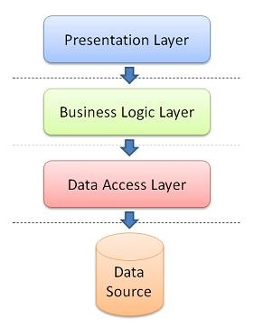

#Day4, Servlets recapitulated
The purpose of this set of exercises is to bridge between the database and the web. Monday we looked at bridging from the database to java domain model objects. Today we will get those domain models up on web pages.

To connect the different levels, we need to look back to the stuff from week 3, and in particular what then was called a 3 tier (or three layer) architecture. The overall structure of a program is called its architecture.
The three tiers (day 3 from week 3) were:

The exercises for today are also part of the study point hand in.

Select one of the repositories for your group (if you are a four person group you are allowed to do this in two groups of two).

The plan is to develop a simple project wich will read from the database from monday. This will be stated as a number of steps which should be using a github project. 

##Exercise 1
Create a new Netbeans Java Web application project - you could name it _webbuildings_. Put the project on GitHub with a commit string of "empty webbuildings project", each member of the group should then clone it.

##Exercise 2
We need a number of stuff in the new webbuildings project. In particular we need:

* a JSP page which can show a list of buildings.
* A domain Facade which implements a method which returns a list of buildings
* The domain classes Building from monday
* Database access to read the buildings from the database we did monday

Each of the above tasks should be done in their own branch. We will then later merge them into the master branch.

*Notice:* Both presentation layer (servlets and jsp) and the database layer depend on the domain model (here the domain model is only the class building - we will ignore room for now). Hence we will do the following:

1. Create a branch domain
1. Add a package domain, with a single class Building (from Monday, or a new)
1. After it compiles, push it to the main repository
1. Merge it into master branch
1. All members pulls the merged master

Remember that "git status" aways tells you which branch you are on.

##Exercise 3
Next we need two new branches, one called _presentation_ and the other named _dbaccess_. 

* In the dbaccess branch, add the code necessary to read the buildings from the database.
* In the presentation layer, add the code necessary to present a list of buildings.

Again, you are free to copy some or all of the code from the project on this weeks GitHub. 

##Exercise 4
We need to be able to update the data about a building. For that we need:

* A way to select a building from the list for editing
* A page which allow the fields of the building to be edited
* Database updating with the new values being entered

Subquestions:

1. Which branches can we make here to allow the group members to work independently on different tasks?
1. Create those branches, and implement the code for those branches?
1. When you are done with a branch merge it into the master branch

